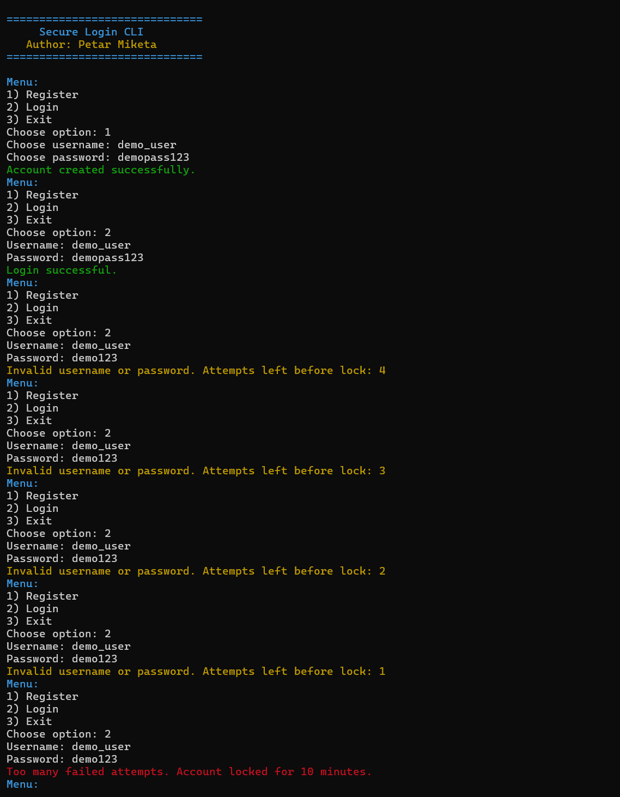
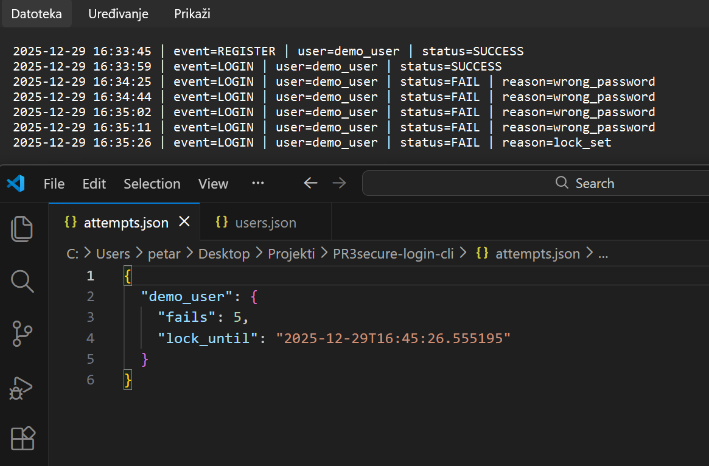

# Secure Login CLI

A Python-based CLI application that demonstrates secure authentication mechanisms and defensive measures against brute-force login attempts.

This project is educational in nature and focuses on how authentication systems are designed to protect user accounts through password hashing, login attempt tracking, account lockout, and audit logging.  
The author takes no responsibility for any misuse of this software.

## Features

- User registration and authentication via CLI
- Secure password storage using bcrypt (salted hashes)
- Tracking of failed login attempts per user
- Automatic account lockout
- Configurable lockout duration
- Audit logging of authentication events

## Usage

Start the application:

```bash
python main.py
```

Register a new user using the CLI menu, then attempt to log in.

After five consecutive failed login attempts, the account is automatically locked for ten minutes.

## Files

- `users.json`  
  Stores registered users and their hashed passwords.

- `attempts.json`  
  Tracks failed login attempts and account lockout timestamps.

- `auth.log`  
  Contains an audit trail of authentication events including successful logins, failures, and lockouts. (The file is generated automatically while the script is running.)

## Screenshots

### CLI Demonstration


### Failed Attempts & Lockout State


### Password Storage


## Notes

This project is designed to simulate defensive authentication logic in a controlled environment.  
It does not target real systems and does not perform any form of attack.

— Petar Miketa
